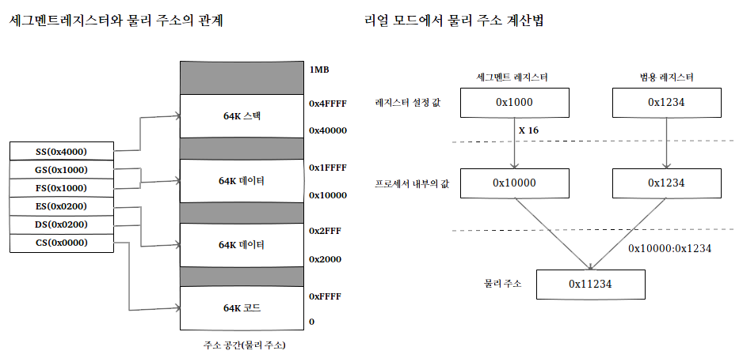
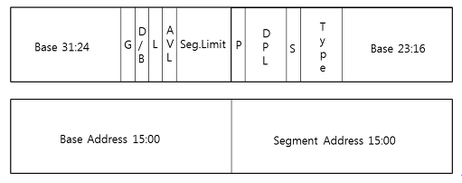
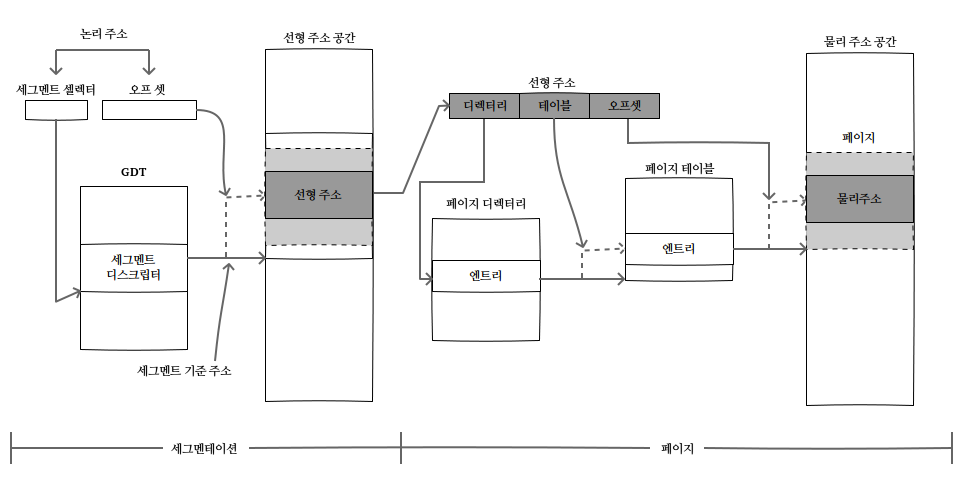
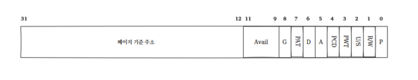
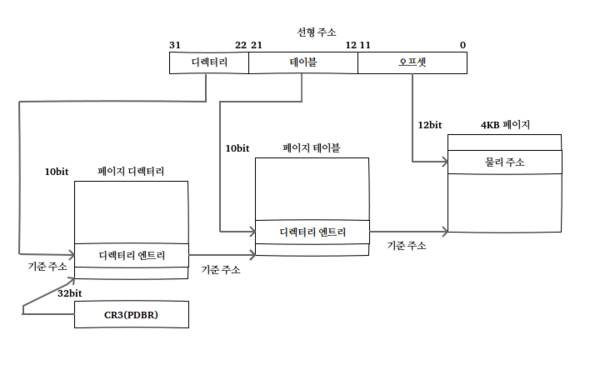
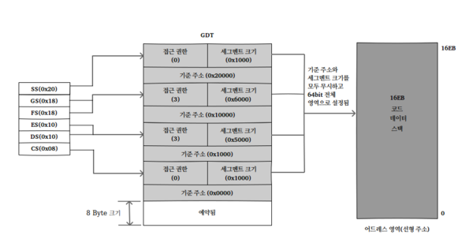
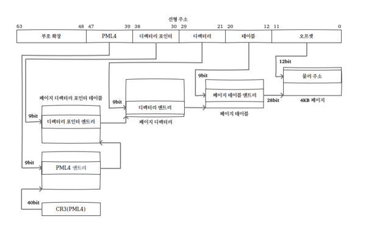
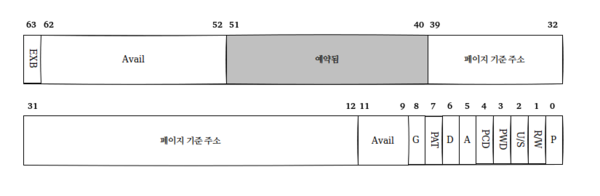

## 3장:  x86-64

### **x86-64의 운영 모드**

x86-64에는 아래와 같은 운영 모드들이 있습니다.

| 운영 모드 | 설명 |
|--------|-----|
| [리얼 모드](https://ko.wikipedia.org/wiki/리얼_모드) | 16비트 모드로 동작 |
| | 80286 이후의 x86 호환 |
| | 1MB의 메모리 주소 지원 |
| [보호 모드](https://ko.wikipedia.org/wiki/보호_모드) | 32비트 모드로 동작 |
| | 다중 작업, 가상 메모리, 페이징을 지원 |
| | 4GB의 메모리 주소 지원 |
| [EM64T (IA-32e) 모드](https://ko.wikipedia.org/wiki/EM64T) | 32비트 호환 모드와 64비트 모드가 존재 |
| | 16EB의 메모리 주소 지원 |
| [가상 8086 모드](https://ko.wikipedia.org/wiki/가상_8086_모드) | CPU가 보호 모드로 작동하여 태스크 관리가 이루어질 때, 8086의 코드가 실행되는 가상 머신의 구현을 하드웨어로 지원 |
| [시스템 관리 모드](https://ko.wikipedia.org/wiki/시스템_관리_모드) | 메모리나 칩셋 오류와 같은 시스템 이벤트를 관리 |
| | 높은 CPU 온도나 시스템 끄기와 같은 시스템 보안 기능을 제공 |
| | 팬 켜기와 같은 전원 관리 기능을 제공 |

> • '리얼 모드'에서는 '보호 모드'로만 전환할 수 있습니다.

> • '보호 모드'에서는 다시 '리얼 모드'로 전환하거나 'EM64T (IA-32e) 모드'나 '가상 8086 모드'로 전환 가능합니다.

> [x86-64 - 위키백과](https://en.wikipedia.org/wiki/X86-64#Operating_modes)

### **레지스터**

**레지스터**는 컴퓨터의 프로세서 내에서 자료를 보관하는 아주 빠른 기억 장소입니다. 일반적으로 현재 계산을 수행 중인 값을 저장하는 데 사용됩니다.

> [프로세서 레지스터 - 위키백과](https://ko.wikipedia.org/wiki/프로세서_레지스터)

위에서 설명했지만 운영 모드는 16비트 모드, 32비트 모드, 64비트 모드가 존재합니다. 운영 모드의 숫자가 클수록 해당 운영 모드의 레지스터 개수도 많습니다.

#### **레지스터의 종류:**

##### **범용 레지스터**

**범용 레지스터**는 데이터와 주소를 모두 저장할 수 있는 레지스터입니다.

x86은 8개의 범용 레지스터, x86-64은 16개의 범용 레지스터를 가지고 있습니다.

범용 레지스터가 많아지면 많아질수록 처리 속도가 빨라지게 됩니다.

| 범용 레지스터 이름 | 설명 |
|:-------------:|:----|
| AX | 산술 연산을 수행할 때 누산기로 사용 |
| BX | 데이터의 어드레스를 지정할 때 데이터 포인터로 사용 |
| CX | 루프 또는 문자열의 카운터로 사용 |
| DX | I/O 어드레스를 지정할 때 사용되며, 산술 연산을 수행할 때 보조 레지스터로 사용 |
| SI | 문자열에 관련된 작업을 수행할 때 원본 문자열의 인덱스로 사용 |
| DI | 문자열에 관련된 작업을 수행할 때 목적지 문자열의 인덱스로 사용 |
| SP | 스택의 포인터로 사용 |
| BP | 스택의 데이터에 접근할 때 데이터의 포인터로 사용 |
| R8 ~ R15 | x86-64 프로세서에서 추가된 범용 레지스터로, 특수 목적은 없습니다. |

> [범용 레지스터(General Purpose Register) - 프로그래머의 길](http://miooim.egloos.com/48019)

##### **세그먼트 레지스터**

**세그먼트 레지스터**는 16비트 레지스터입니다.
주로 어드레스 영역을 다양한 크기로 구분하는 역할을 하며 모드 별로 조금씩 역할에 차이가 있습니다. '리얼 모드'에서는 영역의 구분 역할만 하지만 'EM64T (IA-32e) 모드'에서는 접근 권한 및 세그먼트의 시작 주소와 크기를 지정하는데 사용됩니다.

> 세그먼트 :

> • 가변 크기 블록

> • 가변 크기 데이터 단위

> • 주기억 장치를 논리적으로 나눈 단위

> • 주기억 장치 상에 적재되는 프로그램의 분할 가능한 기본 단위

| 세그먼트 레지스터 이름 | 설명 |
|:-------------:|:----|
| CS | 코드 영역을 가리키는 레지스터 |
| | 데이터 이동 명령으로 값 변경 불가 |
| | 점프 명령이나 인터럽트 관련 명령으로 변경 가능 |
| DS, ES, FS | 데이터 영역을 가리키는 레지스터 |
| | 데이터 이동 명령으로 값 변경 가능 |
| | DS 레지스터는 데이터 영역에 접근할 때 암시적으로 사용 |
| | ES 레지스터는 문자열 관련된 작업을 처리할 때 암시적으로 사용 |
| | 데이터 영역에 접근하면서 DS 레지스터 이외의 세그먼트 레지스터를 사용하려면 세그먼트 레지스터 접두사 사용 |
| SS | 스택 영역을 가리키는 레지스터 |
| | 데이터 이동 명령으로 값 변경 가능 |
| | 스택 관련 레지스터 (SP, BP)를 통해 스택에 접근 시 암시적 사용 |

> [세그먼트 레지스터(Segment Register) - 프로그래머의 길](http://miooim.egloos.com/48037)

##### **컨트롤 레지스터**

**컨트롤 레지스터**는 운영 모드를 변경 및 현재 운영 중인 모드의 특정 기능을 제어하는 레지스터입니다.
x86에는 CR0 ~ CR4 총 5개의 컨트롤 레지스터가 있으며, x86-64에는 CR8 추가되어 총 6개의 컨트롤 레지스터가 존재합니다.

| 컨트롤 레지스터 이름 | 설명 |
|:-------------:|:----|
| CR0 | 운영 모드를 제어하는 레지스터 |
| | 리얼 모드에서 보호 모드로 전환하는 역할과 캐시, 페이징 기능 등을 활성화 |
| CR1 | 프로세서에 의해 예약된 레지스터 |
| CR2 | 페이징 폴트 발생 시 페이지 폴트가 발생한 가상 주소가 저장되는 레지스터 |
| | (페이징 기법 활성화 후, 페이지 폴트 발생 시만 유효함) |
| CR3 | 페이지 디렉터리의 물리 주소와 페이지 캐시에 관련된 기능을 설정 |
| CR4 | 프로세서에서 지원하는 확장 기능을 제어 |
| | 페이지 크기 확장 및 메모리 영역 확장 등의 기능을 활성화 |
| CR8 | 테스크 우선순위 레지스터의 값을 제어 |
| | 프로세스 외부에서 발생하는 인터럽트 필터링 |
| | EM64T (IA-32e) 모드에서만 접근 가능|

> [컨트롤 레지스터(Control Register) - 프로그래머의 길](http://miooim.egloos.com/48142)

### **메모리 관리 기법**

x86과 x86-64에서 지원하는 메모리 관리 기법은 크게 세그먼테이션, 페이징이 있습니다.

- **세그먼테이션(Segmentation)**: 전체 영역을 원하는 크기로 나누어 관리하는 방식
- **페이징(Paging)**: 일정한 단위로 잘라진 조각을 모아 원하는 크기로 관리하는 방식

메모리 관리 기법을 사용하기 위해선 관련 레지스터에 해당 자료구조를 설정해야 합니다.

- **세그먼테이션**: 세그먼트 레지스터에 세그먼트의 시작 주소나 디스크립터의 위치를 설정
- **페이징**: CR3 레지스터에 '페이지 디렉터리'의 물리 주소를 설정

#### **리얼 모드의 메모리 관리 방식**

리얼 모드는 최대 1MB의 주소 공간과 세그먼테이션만 지원합니다.

| 운영 모드 | 설명 |
|--------|-----|
| [리얼 모드](https://ko.wikipedia.org/wiki/리얼_모드) | 16비트 모드로 동작 |
| | 80286 이후의 x86 호환 |
| | 1MB의 메모리 주소 지원 |

리얼 모드의 세그먼트는 64KB로 고정이고 세그먼트의 시작 주소를 세그먼트 레지스터에 직접 설정합니다.

여기서 설정한 세그먼트의 시작 주소는 세그먼테이션에서 코드나 메모리에 접근시 해당 세그먼트 레지스터의 기준 주소에 오프셋을 더하는 방식으로 사용됩니다.

리얼 모드에서 기준주소가 될 세그먼트의 레지스터의 크기와 오프셋인 범용 레지스터는 16비트(최댓값: 65535 (2^16) - 1 )이기 때문에 최대 지원하는 주소 공간인 1MB보다는 부족하게 되는데, 프로세서에서 자체 적으로 세그먼트 레지스터의 기준 주솟값에 16(2^4)을 곱하면 1MB의 공간을 모두 활용할 수 있게 됩니다.

#### **보호 모드의 메모리 관리 방식**

보호 모드는 세그먼테이션과 페이징을 지원합니다.

##### **세그먼테이션(Segmentation)**

여기에서 지원하는 세그먼테이션은 리얼 모드보다 더 많은 기능을 제공합니다.

리얼 모드에서는 세그먼트 레지스터에 세그먼트의 기준 주소를 직접 설정했지만, 보호 모드에서는 디스크립터 자료구조의 위치(오프셋: Offset)을 설정합니다.

**세그먼트 디스크립터 구조:**

세그먼트 디스크립터는 세그먼트의 시작 주소와 크기, 권한(privilege), 타입(Type)의 정보를 가지고 있습니다.
세그먼트 디스크립터의 DPL(Descriptor Privilege Level)은 해당 세그먼트에 접근하기 위한 최소 권한을 나타냅니다.(0 ~ 3)

| Level | 설명 |
|--------|-----|
| Level 0 | 커널 공간 (Core) |
| Level 1 ~ 2 | 커널 공간 (Subsystem) |
| Level 3 | 유저 공간 |

숫자가 낮을수록 권한이 높고 세그먼트 접근시 현재 수행 중인 CPL(Current Privilege Level)이 DPL과 권한이 같거나 높아야 합니다.

위에서 설명했지만 보호 모드에서는 디스크립터 자료구조의 위치를 설정하고 그 값을 가지고 있습니다.

이러한 디스크립터의 모임을 GDT(Global Descriptor Table)이라 합니다.

GDT는 연속된 디스크립터의 집합이며, 최대 8192개의 디스크립터를 포함할 수 있는 테이블 형태의 자료구조입니다.

GDT는 메모리에 위치하는 자료구조이기 때문에 프로세서에 GDT의 위치를 알려줘야 합니다.

GDT의 위치를 가지고 있는 레지스터는 GDTR(Global Descriptor Table Register)이며, 16비트 GDT 크기 필드와 32비트 기준 주소 필드로 구성된 자료구조의 물리 주소를 저장합니다.

프로세서는 GDTR의 값을 내부에 저장했다가 세그먼트 설렉터를 통해 주소에 접근할 때마다 GDT의 위치를 찾는데 참조합니다.

보호 모드에서 주소를 계산하는 방법은 리얼 모드과 같습니다. 하지만 이 주소는 선형 주소이므로 실제 메모리 주소와는 다를 수도 있고 같을 수 도 있습니다. 만약 페이징을 사용하지 않는다면 선형 주소는 리얼 모드처럼 물리 주소와 1:1 대응하게 됩니다.

##### **페이징(Paging)**

물리 메모리를 페이지(Page)라는 일정한 크기로 나누고, 선형 주소와 물리 주소를 나눠 놓은 페이지로 연결하는 방식을 페이징이라고 합니다.

주소 공간을 더 넓게 사용할 수 있는 장점이 있습니다.

**보호 모드에서 세그먼테이션과 페이징을 통해 논리 주소를 물리 주소로 변환하는 과정:**

보호 모드에서 페이징 기법을 사용하려면 페이지의 위치를 프로세서에게 알려줘야 합니다.

CR3 컨트롤 레지스터에 페이지 디렉터리의 기준 주소가 들어가게 됩니다. GDT와 마찬가지로 CR3 컨트롤 레지스터를 이용하여 페이지 디렉터리 엔트리의 위치 계산에 사용합니다.

**페이지 테이블 엔트리 구성:**

페이지 디렉터리 엔트리, 페이지 테이블 엔트리의 사이즈는 모두 4Byte이고 구성은 비슷합니다.

페이지 크기가 최소 4KB이기 때문에, 비트 12 ~ 비트 31로 페이지 기준 주소를 나타내고 나머지 비트는 속성 필드로 사용됩니다.

속성 필드 중에 'U/S (User/Supervisor)'라는 필드가 있는데 U/S 필드는 해당 페이지에 접근할 수 있는 권한을 나타냅니다.

- *U/S 필드(User/Supervisor)는 해당 페이지에 접근할 수 있는 권한:*
**set 0** - 유저 애플리케이션 레벨(3)을 제외한 모든 레벨 접근 가능
**set 1** - 모든 레벨에서 접근 가능

**3단계 페이징과 어드레스 변환 과정:**

1. CR3 레지스터에 설정된 어드레스로 페이지 디렉터리의 시작 주소를 찾아갑니다.
  *(CR3 컨트롤 레지스터에는 페이지 디렉터리의 기준 주소가 있습니다)*

2. 페이지 디렉터리의 시작 주소에 선형 주소의 디렉터리 오프셋을 사용하여, 해당 디렉터리 엔트리를 찾습니다.
  *(디렉터리 엔트리에 설정된 값은 '페이지 테이블'의 시작 주소입니다)*

3. 페이지 테이블의 시작 주소에 선형 주소의 테이블 오프셋을 사용하여, 해당 페이지 테이블 엔트리를 찾습니다.
  *(페이지 테이블 엔트리에 설정된 값이 '4KB 페이지'의 시작 주소입니다)*

4. 페이지의 시작 주소에 선형 주소의 페이지 오프셋 값을 사용하여, 실제 물리 주소 변환합니다.

#### **EM64T (IA-32e) 모드의 메모리 관리 방식**

EM64T (IA-32e) 모드는 32비트 호환 모드와 64비트 모드가 존재합니다.

64비트 모드에서는 최대 16EB의 메모리 주소를 지원합니다.

| 운영 모드 | 설명 |
|--------|-----|
| [EM64T (IA-32e) 모드](https://ko.wikipedia.org/wiki/EM64T) | 32비트 호환 모드와 64비트 모드가 존재 |
| | 16EB의 메모리 주소 지원 |

EM64T (IA-32e) 모드의 메모리 관리 방식은 위에서 설명한 보호 모드의 메모리 관리 방식과 비슷합니다.

주소 공간이 더 커지고 32비트 호환 모드와 64비트 모드를 지원하고 EM64T (IA-32e) 모드의 세그먼테이션은 보호 모드와 달리 모든 세그먼트가 기준 주소는 0, 크기는 64bit 전체로 설정된다는 점입니다.

그리고 32비트 호환 모드와 64비트 모드를 구분하기 위해 '세그먼트 디스크립터'에 L필드(비트 21)를 추가했습니다.

- *코드 세그먼트 디스크립터의 L 필드:*
**set 0** - 32비트 호환 모드로 동작
**set 1** - 64비트 모드로 동작

**EM64T (IA-32e) 모드 세그먼트 셀렉터, 세그먼트 디스크립터, 선형 주소의 관계:**

- 주소 공간이 64비트로 늘어나서 [PAE(물리 주소 확장: Physical Address Extension)](https://ko.wikipedia.org/wiki/물리_주소_확장) 기능이 활성화됩니다.

**EM64T (IA-32e) 모드 5단계 페이징과 어드레스 변환 과정:**

- 주소 공간이 늘어나면서 4KB 페이지는 5단계로, 2MB 페이지는 4단계로 변경됩니다.
  *(변환 과정이 늘어났을 뿐이며 보호 모드와 과정은 동일합니다)*
- PML4(Page Map Level 4 Table), PDPT(Page Directory Pointer Table) 테이블이 추가됩니다.

**EM64T (IA-32e) 모드의 페이지 테이블 엔트리:**

- 주소 공간이 늘어나면서 페이지 엔트리가 8바이트로 커졌습니다.
- EXB 필드의 추가로 OS의 보안성이 증가하였습니다.
